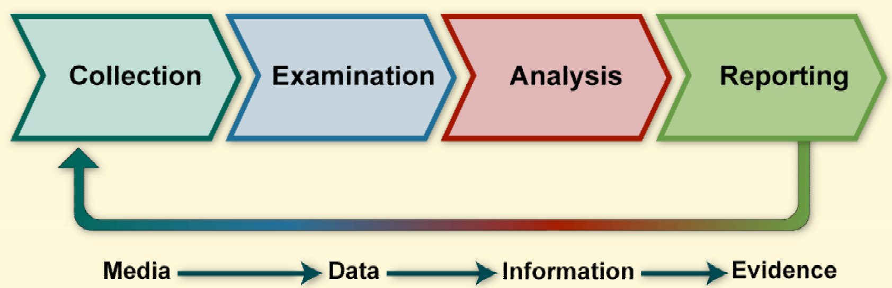

# Notes from NIST SP 800-86
The document provides general recommendations for performing the forensic process.

There are 4 basic phases in the process of performing digital forensics:

1. **Collection**
2. **Examination**
3. **Analysis**
4. **Reporting**

## Collection

### Identifying Possible Sources of Data

Common data sources for collection include desktop computers, servers, laptops, and network storage devices. External media—such as USB flash drives, memory cards, optical discs, and magnetic disks—are also critical sources of evidence.

Beyond traditional hosts, analysts should identify potential data sources in other network locations. To support forensic preparedness, organizations can proactively configure systems to collect relevant data, notably by implementing centralized logging and monitoring user behavior.

### Acquiring the Data

After identifying the data, analysts need to acquire the data. The acquisition process is recommened to be performed in three steps:

1. **Develop an acquisition plan:** Prioritize data sources based on three primary factors: likely value, volatility, and the effort required for collection.
2. **Acquire the data:** Use forensic tools to capture volatile data, duplicate non-volatile sources, and secure original physical media (unless already collected by other security systems).
3. **Verify data integrity:** Confirm the integrity of all acquired data immediately following collection.

**Operational Practices:**
Maintain a detailed, reproducible log of every acquisition step and tool used. Before interacting with any system, document or photograph the live display (running programs, open documents). If possible, designate a single evidence custodian to document, label, and photograph all collected items, logging who performed each action, where, and when.

## Examination

After data has been collected, the next phase is to examine the data, which involves assessing and extracting the relevant pieces of information from the collected data.

There are many tools help doing this phase:

- **Text and pattern searches:** Identify pertinent data like keywords, subjects, or email addresses in documents and logs.
- **File type analyzers:** Determine file content types (e.g., text, graphics, archives) to prioritize relevant data and filter out unrelated files.
- **Known-file databases (hash lists):** Reference databases of known file signatures to automatically include or exclude files from analysis.

## Analysis

Once the relevant information has been extracted, the analyst should study and analyze the data to draw conclusions from it. The foundation of forensics is using a methodical approach to reach appropriate conclusions based on the available data or determine that no conclusion can yet be drawn.

## Reporting

The final phase is reporting, there are many factors affect this, including:

- **Alternative Explanations**: Contradicting explanation regarding one event (typically one that is incomplete).
- **Audience Consideration**: Reporting should be suitable to the audience to which the data or information will be shown. 
- **Actionable Information**: Reporting also includes identifying actionable information gained
from data that may allow an analyst to collect new sources of information.

## Some good principles

1. Organizations should perform a consistent forensic process.
2. Analysts should be aware of the range of possible data sources.
3. A methodical approach is recommended to studying the data
4. Analysts should review their processes and practices

References:
- Kent, K., Chevalier, S., Grance, T., Dang, H., National Institute of Standards and Technology, & Booz Allen Hamilton. (2006). Guide to Integrating Forensic Techniques into Incident Response. In NIST Special Publication 800-86. National Institute of Standards and Technology. https://nvlpubs.nist.gov/nistpubs/Legacy/SP/nistspecialpublication800-86.pdf