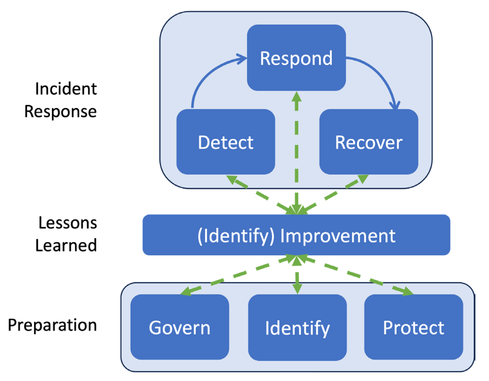

# NIST SP 800-61 Revision 3

The central idea is that incident response should be integrated throughout cybersecurity risk management rather than treated only as an emergency activity after an alert.

The lifecycle of Incident Response:
- Preparation -> Govern, Indentity, Protect
- Detection and Analysis -> Detect
- Containment, Eradication and Recovery -> Respond, Recover
- Post-incident Activity -> Govern, Indentity, Protect

Forensic investigation exists inside a larger incident-response and cybersecurity-risk-management process.

References:
- Nelson, A., Rekhi, S., Souppaya, M., Scarfone, K., National Institute of Standards and Technology, Computer Security Division, & Scarfone Cybersecurity. (2025). Incident Response Recommendations and Considerations for Cybersecurity Risk Management: A CSF 2.0 Community profile. National Institute of Standards and Technology. https://nvlpubs.nist.gov/nistpubs/SpecialPublications/NIST.SP.800-61r3.pdf
